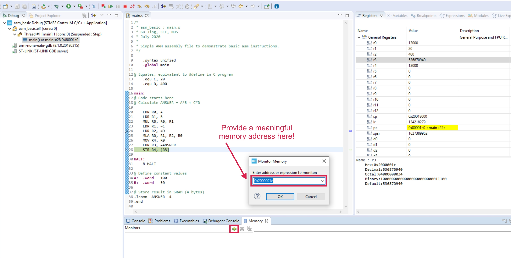

Main resource: https://wiki.nus.edu.sg/display/EE2028/PCI-1+%5BWeek+3%5D%3A+Familiarization+with+Development+Environment

# Section 3
## Discussion 1: both blink_plain_C and blink_pure_asm are blinking the LED, why is there a difference between blink_pure_asm and the disassembled code of blink_plain_C?
- The difference arises due to assembly being closer to machine instructions than C language. There is a slight overhead when using C compared to using in assembly.

**Note**: when inspecting the memory, make sure you are providing a meaningful memory address, otherwise you will not be able to locate the data you are looking for. Also, STM32CubeIDE allows the users to modify the data in the registers and memory, which may useful during certain condition of debugging. However, please be very careful when modifying registers and memory locations, as it may cause program failure.



# Section 4

## Discussion 2: what is the difference between LDR and MOV?
- LDR or STR is for transfers to/from a register from/to memory (hence the [ ] dereferencing operator), while MOV is to transfer to a register (Rd) an immediate constant value or from another register.

## Discussion 3: what is the difference between LDR and STR?
- LDR loads register Rt with value from stated memory
  ```assembly
  main:
    LDR R2, [R1]
    LDR R4, [R3],#4 ; Post-Offset addressing
    LDR R6, [R5, #offset] ; Pre-Offset addressing
    LDR R1, R2 ; PC-relative addressing
    LDR R1 ,=0x123 ; Pseudo instruction, Load memory address
    LDR R1 ,= 12 ; Pseudo instruction, Load value

  ```
- STR stores value in register R1 to stated memory
  - `STR R1, [R0]`

## Discussion 4: what is the difference between .equ and .word when declaring constants? What are the memory addresses of constant A and B respectively? And what are the memory addresses of constant C and D?
- .equ sets the value of a symbol to expression similar to `#define PI 3.14`, while .word allocates a word-sized amount of storqage space in that memory location. It can also initalise that location with a given value.
- A label is simply a string used to name an instruction. A label may also refer to the location of a specific instruction in the memory. The assmbler convert this label into an address that points to the instruction. As such, `.equ` and `.word` does not have a memory address.

## Homework

- C equivalent
```c
int main()
{
    // to store all the odd numbers between 50 and 100 into the memory
    int x = 50;
    do
    {
      
    } while (x != 100);
    return 0;
}
```